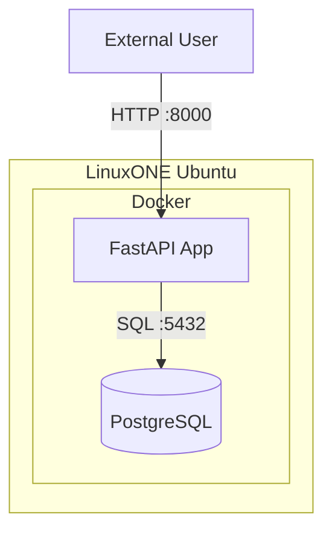

# Part 1 - Prerequisites
* Register at LinuxOne Community Cloud <a href="https://linuxone.cloud.marist.edu/#/register?flag=VM" target="_blank"  rel="noopener noreferrer">here</a> for a trial account and get a Ubuntu VM.

* Click on Try Virtual Machines on the LinuxONE™ Community Cloud


# Part 2 – Setup your environment on LinuxONE VM
# Setup Guide

### Prerequisite:
- docker & docker compose
- jq
- make (optional)
```bash
sudo systemctl restart snapd
sudo apt update
sudo snap install docker
sudo snap install jq
```
```bash
sudo usermod -aG docker linux1
# above changes won't apply until the user starts a new shell session
# Exit your current shell
exit
# Then log back in:
ssh -i mykey.pem linux1@<your-server>
```
```bash
git clone https://github.com/codesenju/api_pgmoviedb.git
cd api_pgmoviedb/
```
### Quick Setup:
```shell
docker compose --profile quick-setup build
# [+] Building 2/2
# ✔ fastapi    Built
# ✔ pgmoviedb  Built

docker compose --profile quick-setup up -d
# [+] Running 2/2
# ✔ Container postgres  Running 
# ✔ Container fastapi   Running

docker compose --profile quick-setup logs -f
# postgres  | title.basics.tsv imported!
# ...
# postgres  | 2025-05-16 19:26:23.344 UTC [1] LOG:  database system is ready to accept connections
```
### Test API

```shell
curl localhost:8000/api/v1/movies | jq 
```
## Visit the api documentation: http://\<linux1-ip\>:8000/docs


# 📜 Disclaimer

This project uses IMDb data, which is freely available for personal and non-commercial use under IMDb’s [Terms and Conditions](https://www.imdb.com/conditions).

### ⚠️ Important Notes:

- The IMDb dataset used in this project is obtained from IMDb’s [official data dumps](https://datasets.imdbws.com/).
- **IMDb owns all rights to the data**. This project does **not** claim ownership of any IMDb data.
- The use of IMDb data in this project is solely for educational, research, or personal testing purposes.
- This project is **not affiliated with or endorsed by IMDb or Amazon** in any way.
- Redistribution of IMDb data outside of IMDb’s licensed use is **prohibited**.

### Usage Terms

By using this project, you acknowledge that:

- You are responsible for complying with IMDb’s terms of service.
- You must not use this project or its dataset for commercial purposes.
- You must not publicly redistribute IMDb data unless explicitly permitted by IMDb.
