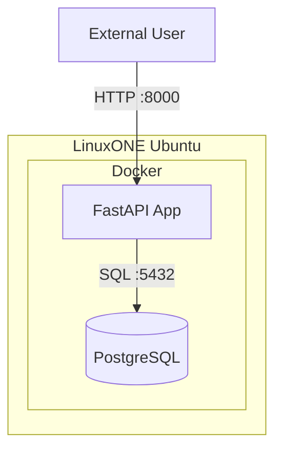

# Part 1 - Prerequisites
* Register at LinuxOne Community Cloud <a href="https://linuxone.cloud.marist.edu/#/register?flag=VM" target="_blank"  rel="noopener noreferrer">here</a> for a trial account and get a Ubuntu VM.

* Click on Try Virtual Machines on the LinuxONE™ Community Cloud


# Part 2 – Setup your environment on LinuxONE VM
# Setup Guide

### Prerequisite:
- docker & docker compose
- jq
- make (optional)
```bash
sudo systemctl restart snapd
sudo apt update
sudo snap install docker
sudo snap install jq
sudo usermod -aG docker linux1
# above changes won't apply until the user starts a new shell session
# Exit your current shell
exit
# Then log back in:
ssh -i mykey.pem linux1@<your-server>

git clone https://github.com/codesenju/api_pgmoviedb.git
cd api_pgmoviedb/
```
### Quick Setup:
```shell
docker compose --profile quick-setup build
# [+] Building 2/2
# ✔ fastapi    Built
# ✔ pgmoviedb  Built

docker compose --profile quick-setup up -d
# [+] Running 2/2
# ✔ Container postgres  Running 
# ✔ Container fastapi   Running

docker compose --profile quick-setup logs -f
# postgres  | title.basics.tsv imported!
# ...
# postgres  | 2025-05-16 19:26:23.344 UTC [1] LOG:  database system is ready to accept connections
```
### Test API

```shell
curl localhost:8000/api/v1/movies | jq 
```
## Visit http://\<linux1-ip\>:8000/docs